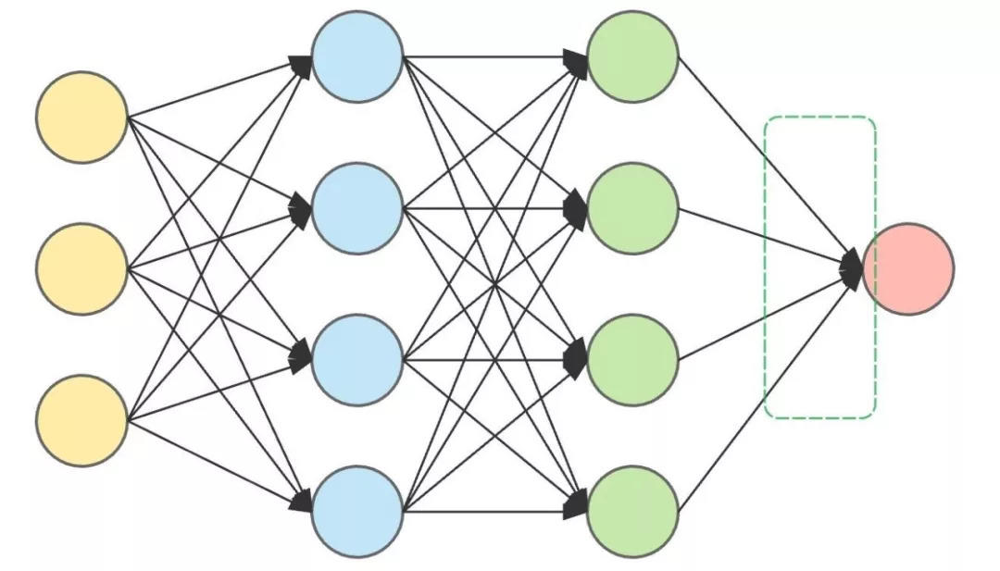
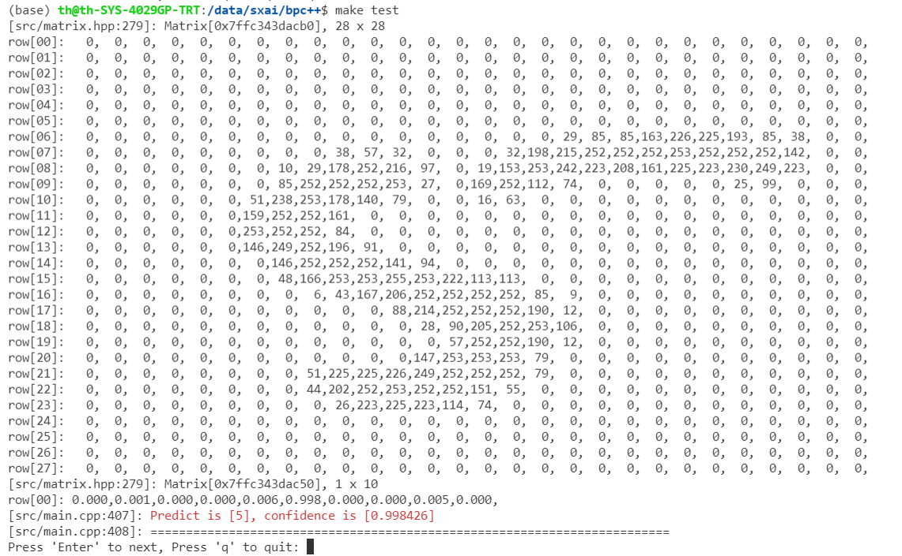
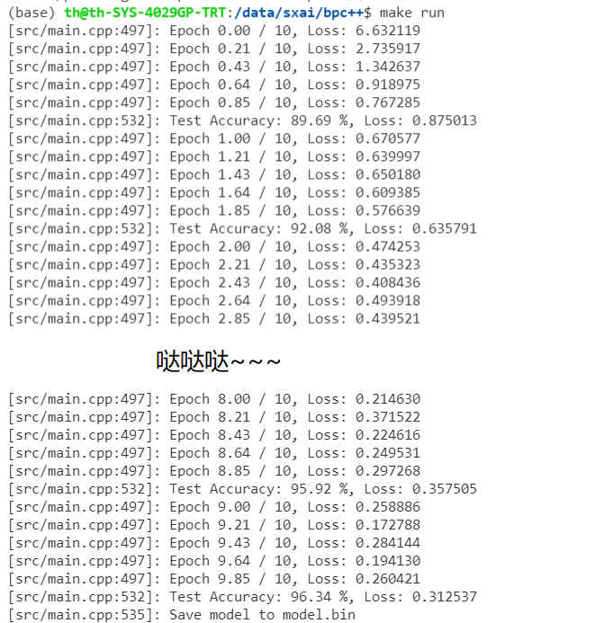

## 彻底弄懂BP反向传播，15行代码，C++实现也简单，MNIST分类98.29%精度
1. 使用C++实现图像分类，10轮nmist识别率达到<font color=red>**98.29%**</font>
2. 基于mnist数据集的BP算法，专业
3. 大量的备注，为了你学懂
4. 代码简单，核心代码15行
5. 仅仅依赖OpenBLAS（为了速度），如果不依赖太慢了。可以学习下

## 训练技巧
1. 权重初始化，凯明初始化，fan_in + fan_out
2. ReLU激活函数
3. SGD Momentum
4. 学习率衰减
5. loss函数中log的上下溢控制
6. sigmoid的exp上溢控制



## 执行起来
1. 下载数据集/依赖项，并解压编译
- bash ./download.sh这个环节干了两件事
    - 第一下载mnist数据集
    - 第二下载OpenBLAS依赖项，并且解压后编译
```bash
git clone git@github.com:shouxieai/bp-cpp.git
cd bp-cpp
bash ./download.sh
```

2. 运行
```bash
make test               测试查看效果
make image              加载workspace/5.bmp文件识别
make train              训练模型
```

## 如果失败，请手动完成
1. 下载[OpenBLAS](https://github.com/xianyi/OpenBLAS/releases)，编译后放到lean目录下，确保Makefile中路径匹配正确
2. 下载[MNIST数据集](http://yann.lecun.com/exdb/mnist/)放到workspace目录下
3. 执行`make train`训练模型，然后`make test`进行模型测试

## 使用方式
```bash
cd workspace 

Help: 
     ./pro train        执行训练
     ./pro test         执行测试
     ./pro image 5.bmp  加载28x28的bmp图像文件进行预测
```

## 执行起来的效果图


## 训练的效果图


## 关于
- 进博客扫码加微信进群
1. 我们的博客：http://www.zifuture.com:8090/archives/bp
2. 我们的B站：https://space.bilibili.com/1413433465/
    - 关于BP的C++视频教程可崔更